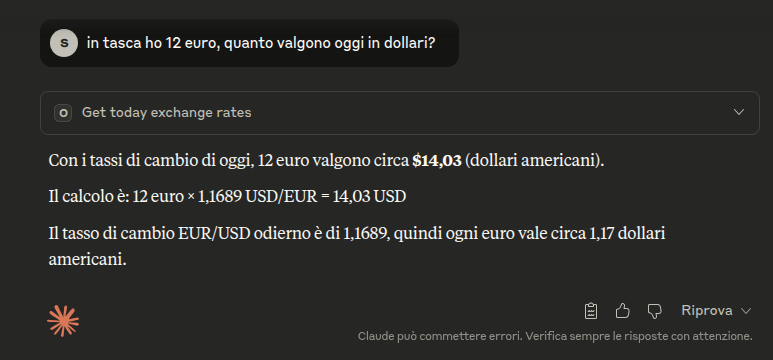
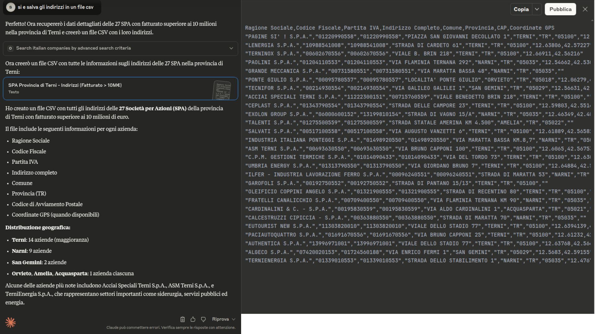

# Claude Desktop
This documentation contains examples and quick tips for configuring the mcp.openapi.com server
within Claude Desktop.

## Official Sites and Documentation
The following links provide the official and detailed documentation, which we recommend consulting:

https://support.anthropic.com/en/articles/10065433-installing-claude-desktop

http://claude.ai/download

## Configuration

1. Copy the example file `claude_desktop_config.json` to the correct directory based on your system:
   - Linux: The file is located at `~/.config/Claude/claude_desktop_config.json`
   - macOS: The file is located at `~/Library/Application Support/Claude/claude_desktop_config.json`.
     This path is also mentioned as the location for the configuration file in the official quickstart guide.
   - Windows: The file is located at `%APPDATA%\Claude\claude_desktop_config.json`.
     This path can be accessed by opening the Run dialog (Windows Key + R) and entering `%APPDATA%\Claude`

2. Edit the `claude_desktop_config.json` file and replace `{OPENAPI_TOKEN}` with a token generated via [openapi.com](https://openapi.com):
   ```json
    {
      "mcpServers": {
        "openapi.com": {
          "command": "npx",
          "args": [
            "mcp-remote",
            "https://mcp.openapi.com/",
            "--header",
            "Authorization: Bearer {OPENAPI_TOKEN}"
          ]
        }
      }
    }
   ```

3. Save the file and launch Claude Desktop to verify that it is correctly configured.

## Usage Example

### Verifying Connection to the MCP Server
Once Claude Desktop is launched:
- 1) Click on Search & Tools
- 2) Verify the list of available tools by clicking on openapi.com


If the list of tools is displayed correctly, you are ready to start!

### Trying the Service
If the token provided is valid, you can start "talking" naturally with the integrated services of openapi.com through the selected language model. In this demonstration, "Claud Sonnet 4" is selected; refer to the client's documentation for more details on available models, their costs, and availability.

Let's ask the model a simple question: I have 12 euros in my pocket, how much are they worth in dollars today?

Authorization is requested to execute the specific MCP tool call to mcp.openapi.com (in this case, "get_today_exchange_rates"), which can be one-time or permanent:


By authorizing the client, you will immediately receive the response:



### Something More Complex

## How many corporations have a turnover above 10 million in the province of Terni?


In this example, the `dryRun` property of the company.openapi.com API was automatically set, allowing a free "count" and a "cost" estimate based on the criteria entered for a hypothetical dataset extraction.


## Extracting a Dataset



## "Generate an HTML report for OpenAPI S.p.A."


