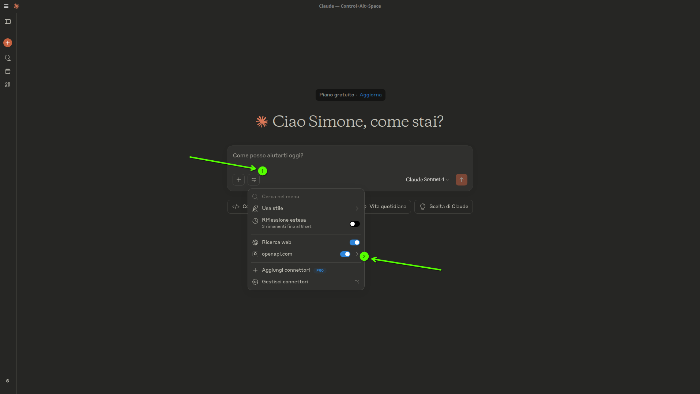
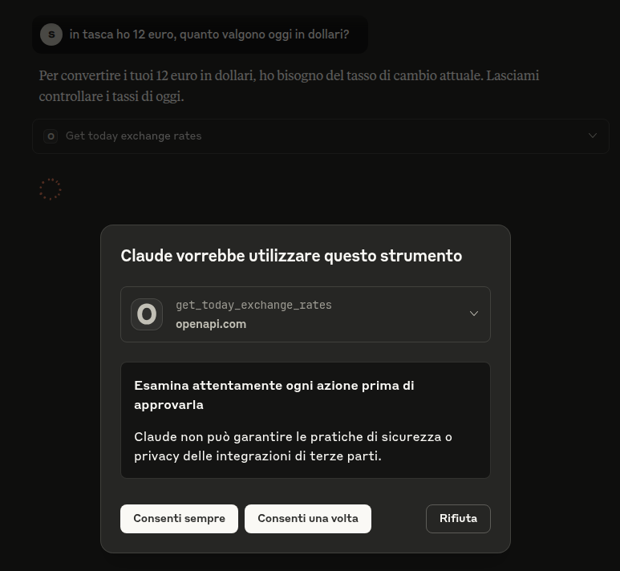
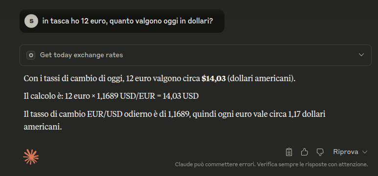
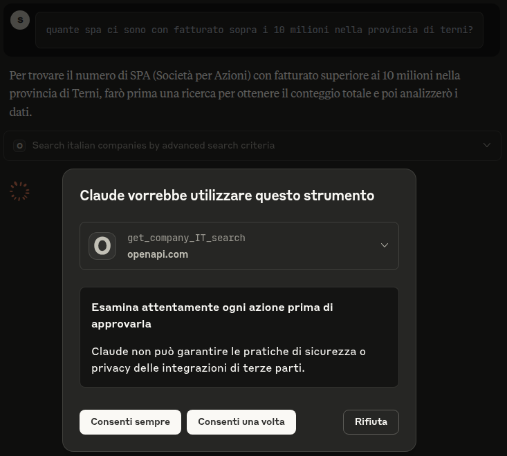
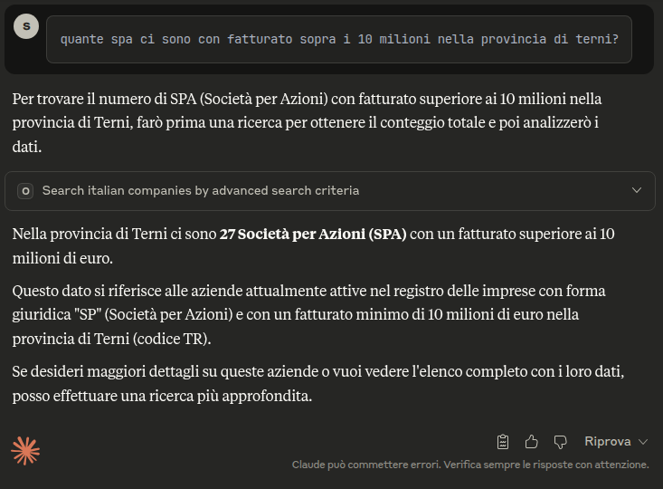
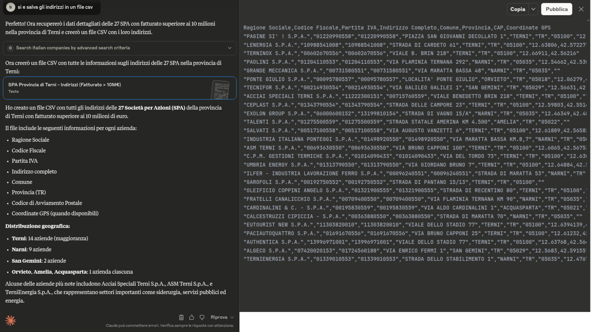
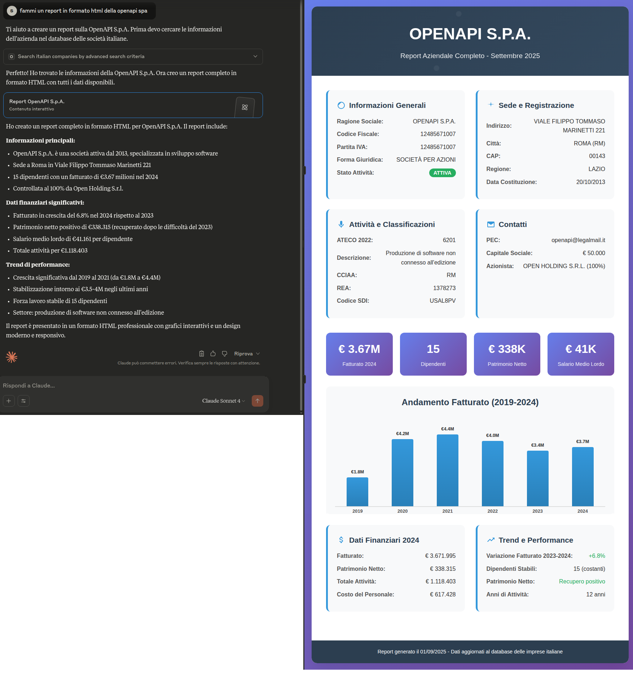

# Claude Desktop
In questa documentazione sono raccolti degli esempi e dei rapidi consigli per configurare il server mcp.openapi.com
all'interno di Claude Desktop.

## Siti ufficiali e documentazione
A questi indirizzi è presente la documentazione ufficiale ed approfondita che consigliamo di consultare.

https://support.anthropic.com/en/articles/10065433-installing-claude-desktop

http://claude.ai/download


## Configurazione

1. Copia il file di esempio `claude_desktop_config.json` nella directory corretta directori in base al tuo sistema:
  - Linux: Il file si trova in `~/.config/Claude/claude_desktop_config.json`
  - MacOS: Il file si trova in `~/Library/Application Support/Claude/claude_desktop_config.json`.
   Questo percorso è anche menzionato come posizione del file di configurazione nella guida rapida ufficiale.
  - Windows: Il file si trova in `%APPDATA%\Claude\claude_desktop_config.json`.
   Questo percorso può essere raggiunto aprendo la finestra di dialogo Esegui (Tasto Windows + R) e inserendo `%APPDATA%\Claude`.

2. Modifica il file `claude_desktop_config.json` e sostituisci `{OPENAPI_TOKEN}` con un token generato tramite [openapi.com](https://openapi.com):
   ```json
    {
      "mcpServers": {
        "openapi.com": {
          "command": "npx",
          "args": [
            "mcp-remote",
            "https://mcp.openapi.com/",
            "--header",
            "Authorization: Bearer {OPENAPI_TOKEN}"
          ]
        }
      }
    }

   ```

3. Salva il file e lancia Claude Desktop per verificare che sia configurato correttamente

## Esempio di utilizzo

### Verifica di connessione al server MCP
Una volta avviato Claude Desktop:
- 1) Cliccare su ricerca & strumenti
- 2) Verificare l'elenco dei tools disponibili cliccando su openapi.com



Se vediamo correttamente l'elenco dei tools siamo pronti per iniziare! 

### Proviamo il servizio
Se il token inserito è valido possiamo iniziare a "parlare" in maniera naturale con i servizi integrati di openapi.com attraverso il modello di linguaggio selezionato. In questa dimostrazione è selezionato "Claud Sonnet 4", consultare la documantazione del client per un approfondimento sui modelli disponibili e i loro costi e disponibilità.


Facciamo semplice domanda al modello: in tasca ho 12 euro, quanto valgono oggi in dollari?


Viene richiesta l'autorizzazione ad eseguire la chiamata allo specifico tool MCP di mcp.openapi.com (in questo caso "get_today_exchange_rates") che può essere one-time o permanente.:



Autorizzando il client si otterrà immediatamente la risposta:



### Qualcosa di più complesso

## quante spa ci sono con fatturato sopra i 10 milioni nella provincia di terni?



In questo esempio è stata automaticamente impostata la proprietà dryRun dell'api company.openapi.com che permette di avere gratuitamente un conteggio "count" ed un preventivo "cost" relativo ai criteri inseriti per una ipotetica estrazione del dataset.



## Estraiamo un dataset



## "fammi un report in formato html della openapi spa"

