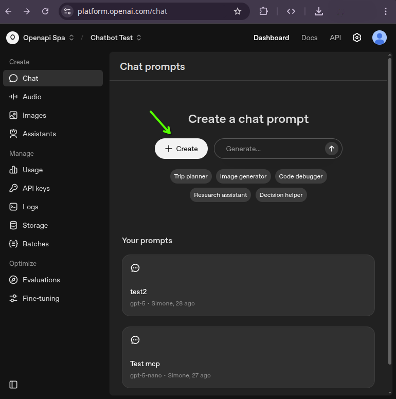
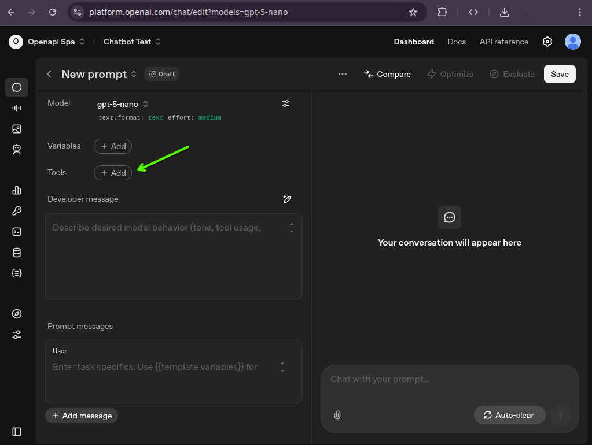
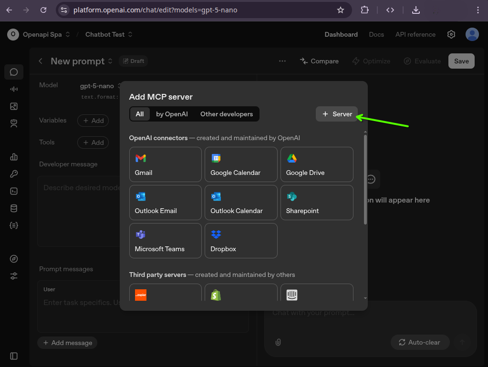
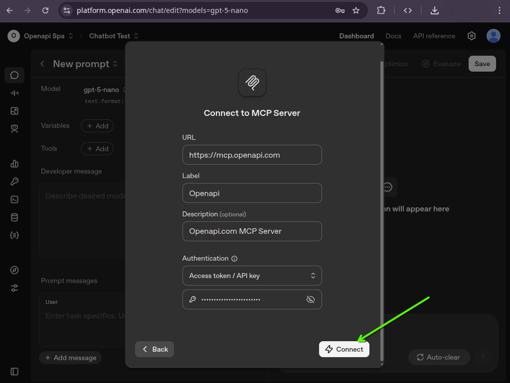
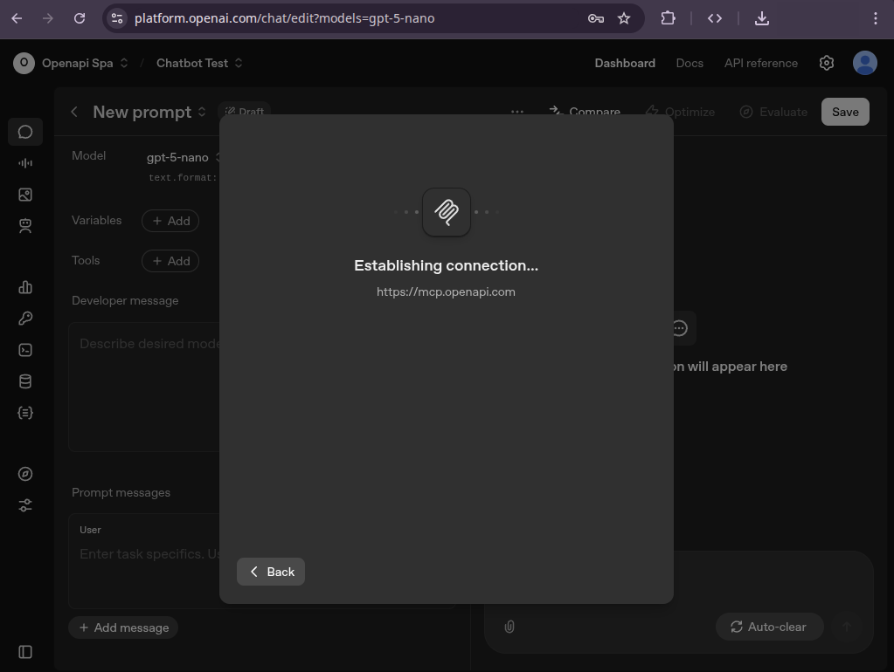
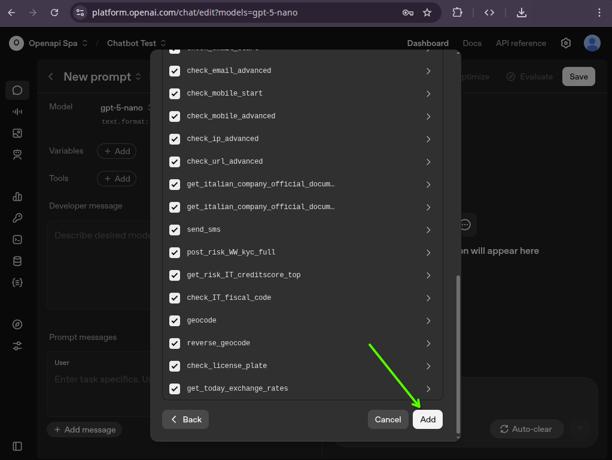
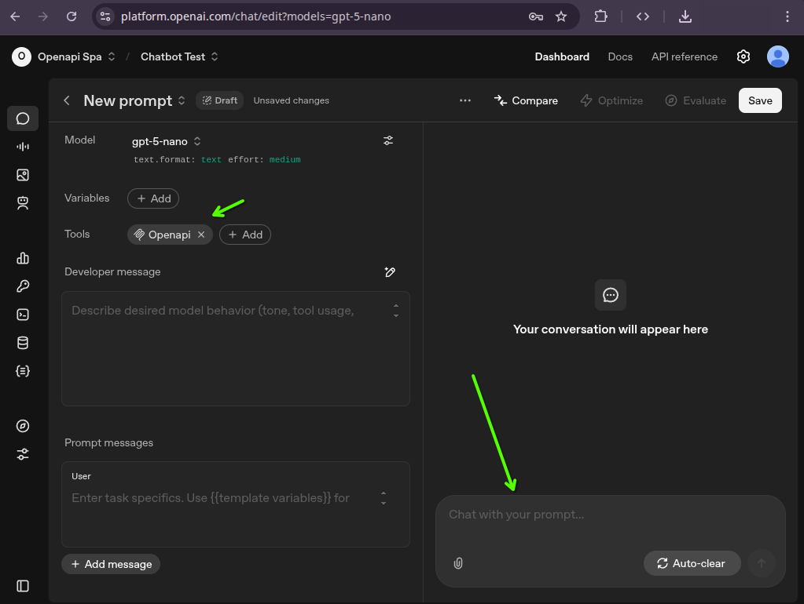
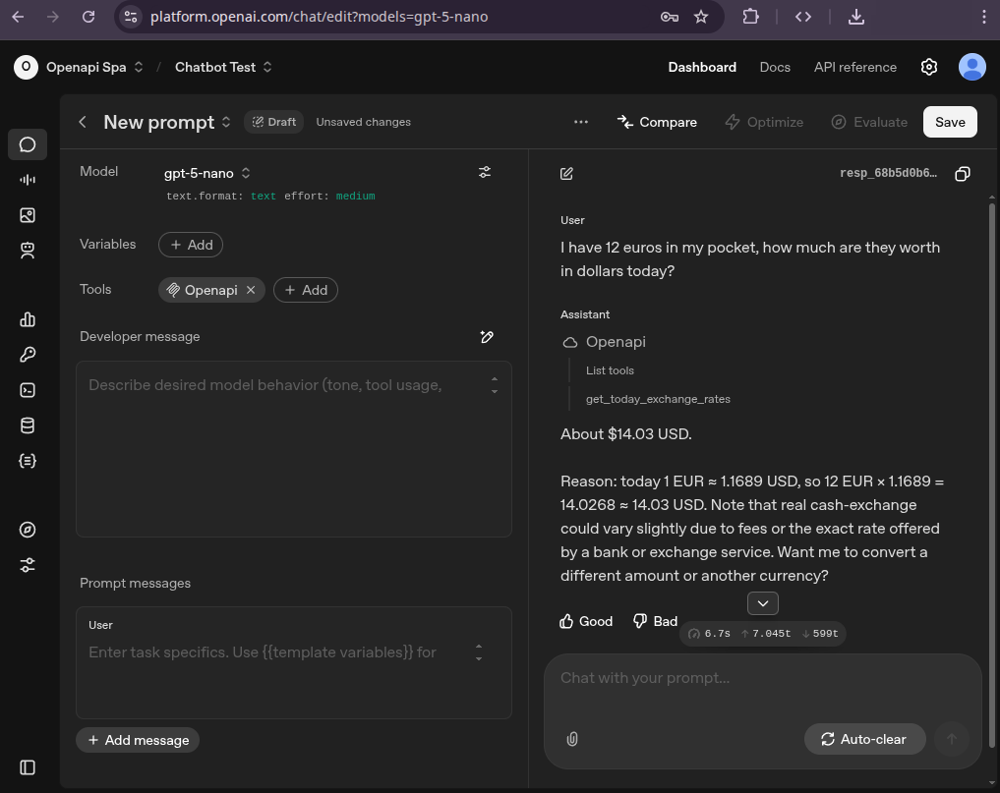

# OpenAi Chat

## Create a new chat

From https://platform.openai.com/chat click on "+ Create":

## Add New Tool

Click on "+ Add" on the "Tools" section of the chat configurations and select "MCP Server":

## Add New Server

Click on "+ Server" on the "Tools" section of the chat configurations and select "MCP Server":

## Connect to server

Fill the form with:
- Url: https://mcp.openapi.com
- Authentication: Access token / API key
- Insert your token in the "key" field

Click on "Connect" and waith a second for tools discovering:

## Adding the available tools

Once you connected to the server you will receive a list of available tools.
Scroll down e click on "Add" 

## Test the integration

Now you are connected and you can start testing the integration:

## Asking something

Q: I have 12 euros in my pocket, how much are they worth in dollars today?

