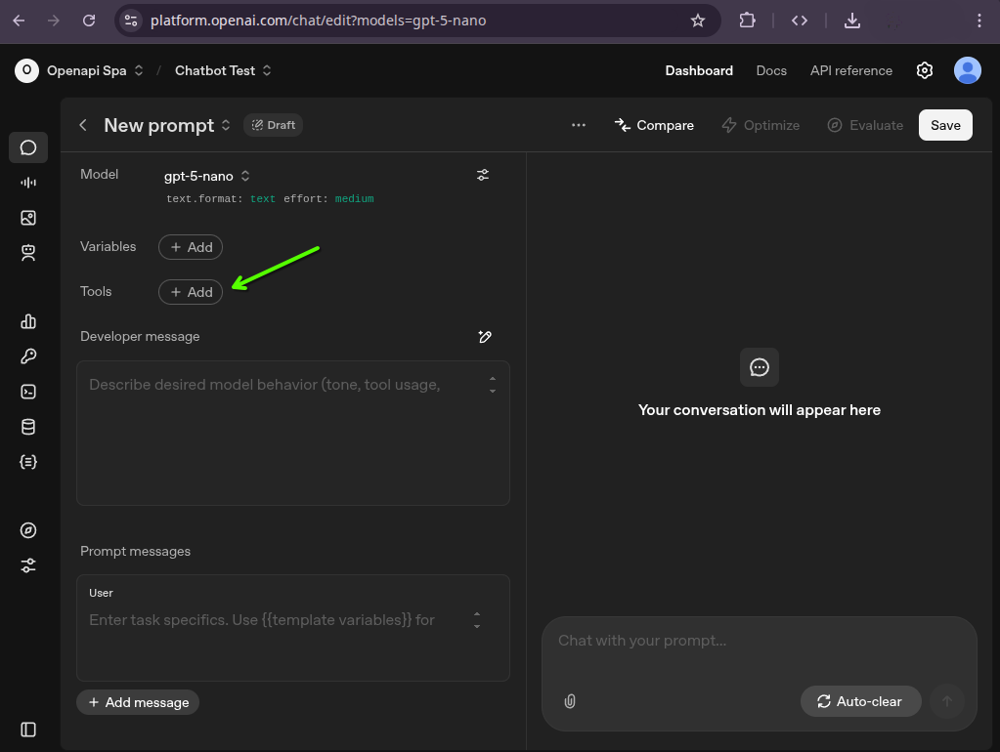
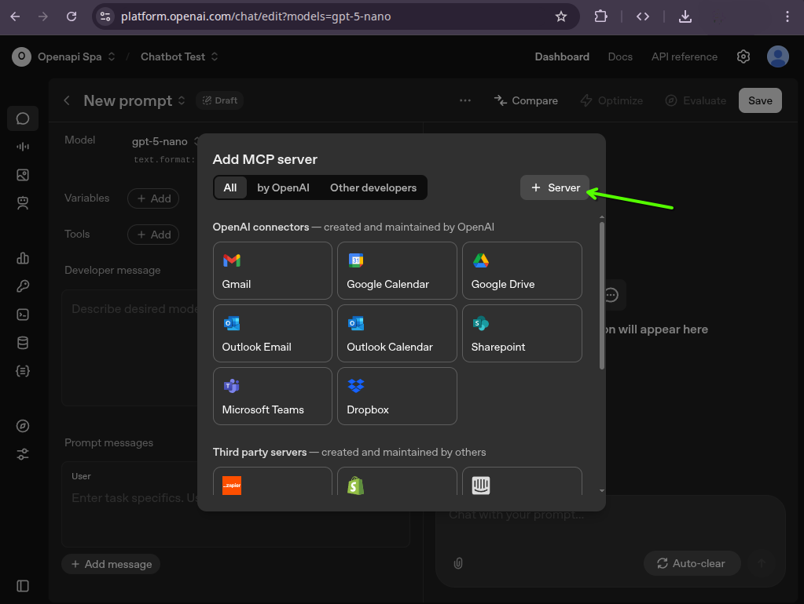
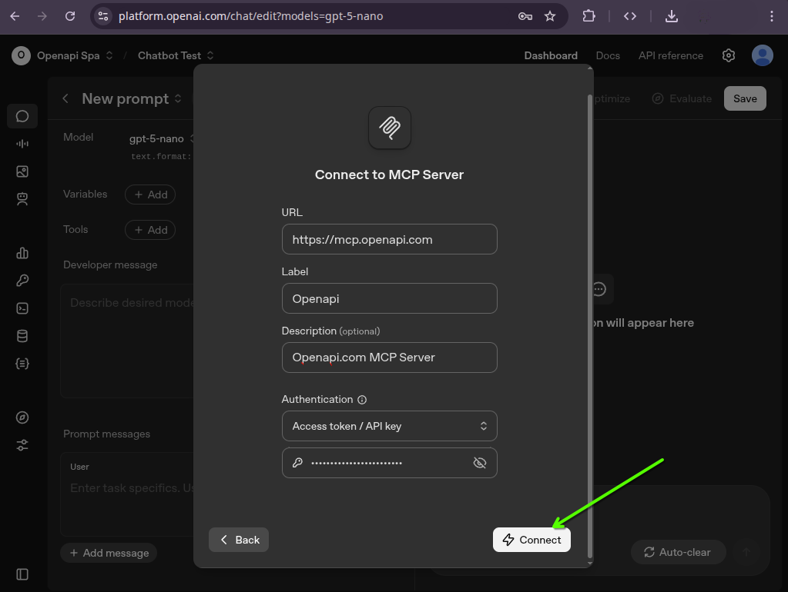
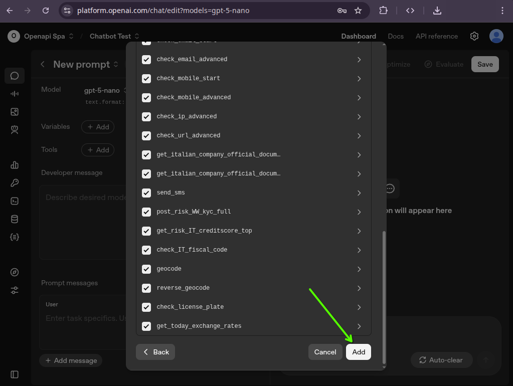
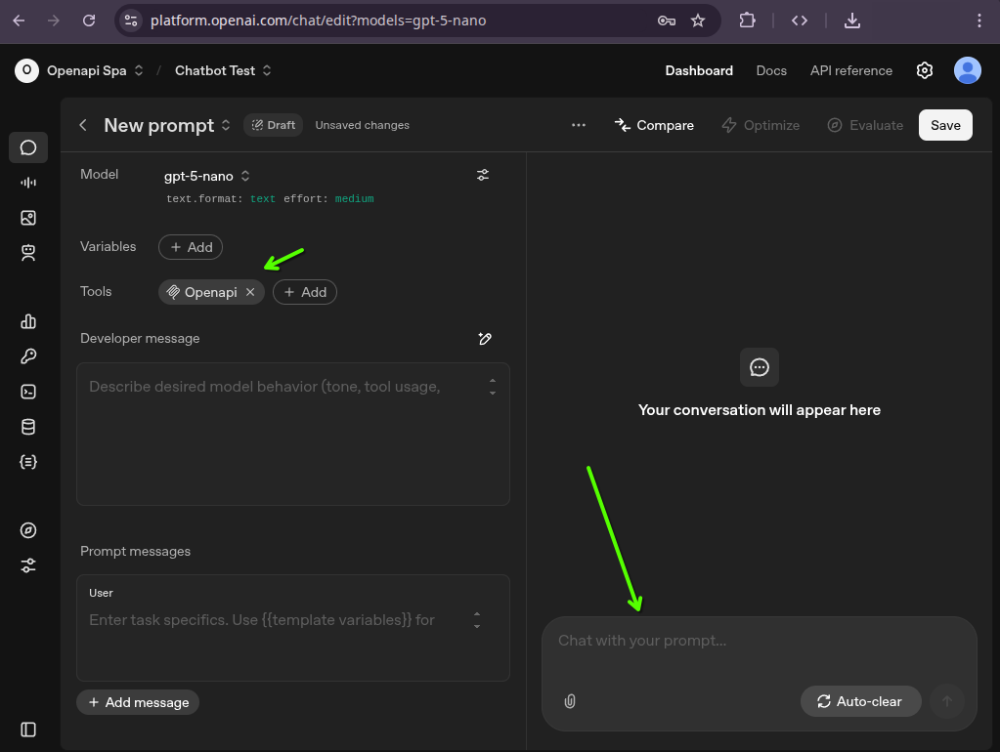
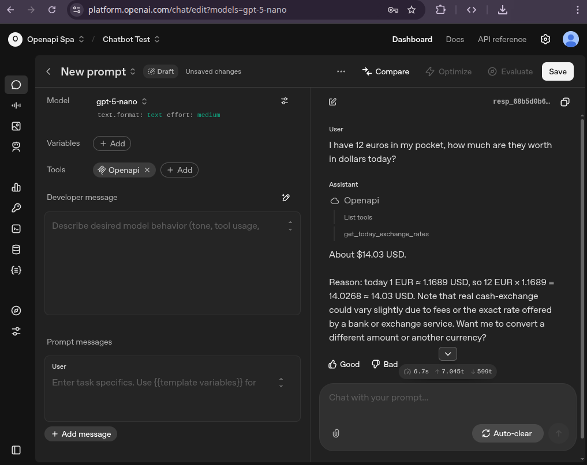

# OpenAi Chat

## Creare una nuova chat

Da https://platform.openai.com/chat clicca su "+ Create":

## Aggiungere un nuovo strumento

Clicca su "+ Add" nella sezione "Tools" delle configurazioni della chat e seleziona "MCP Server":

## Aggiungere un nuovo server

Clicca su "+ Server" nella sezione "Tools" delle configurazioni della chat e seleziona "MCP Server":

## Connettersi al server

Compila il modulo con:
- Url: https://mcp.openapi.com
- Authentication: Access token / API key
- Inserisci il tuo token nel campo "key"

Clicca su "Connect" e aspetta un secondo per la scoperta degli strumenti:

## Aggiungere gli strumenti disponibili

Una volta connesso al server riceverai un elenco degli strumenti disponibili.
Scorri verso il basso e clicca su "Add" 

## Testare l'integrazione

Ora sei connesso e puoi iniziare a testare l'integrazione:

## Fare una domanda

D: Ho 12 euro in tasca, quanto valgono in dollari oggi?

